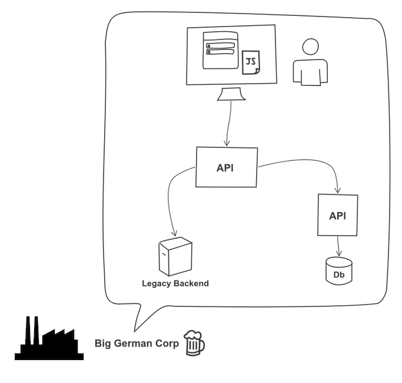
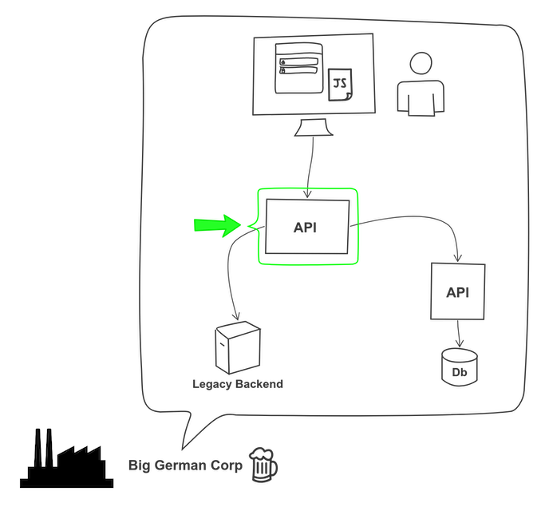
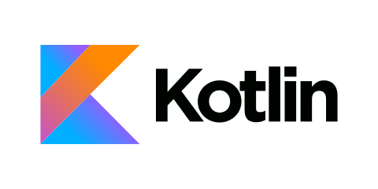
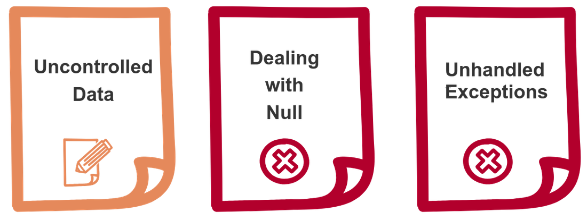
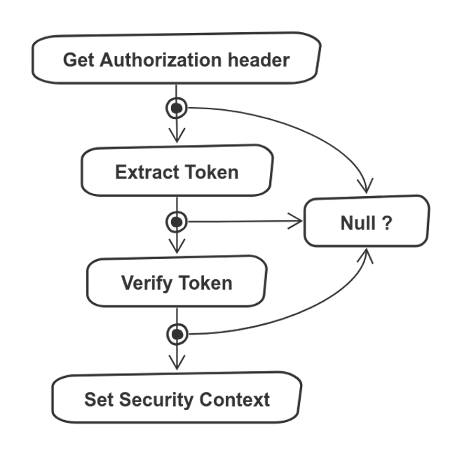
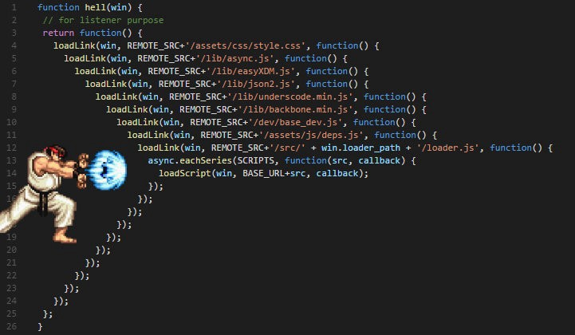
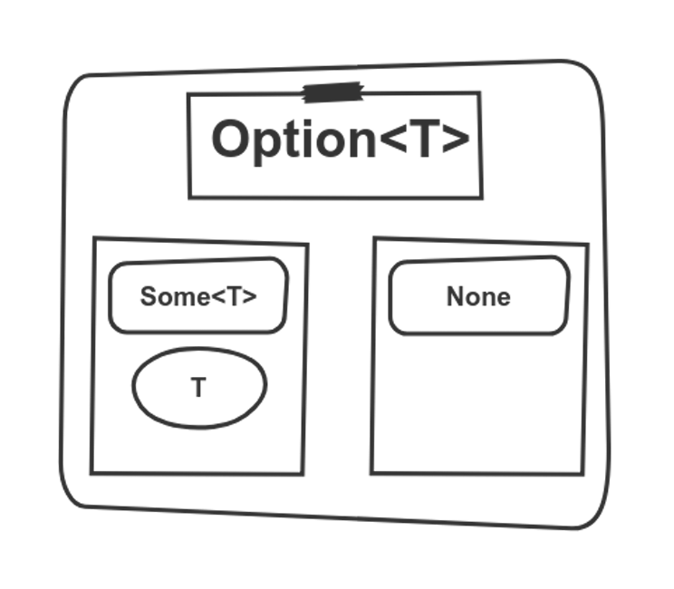
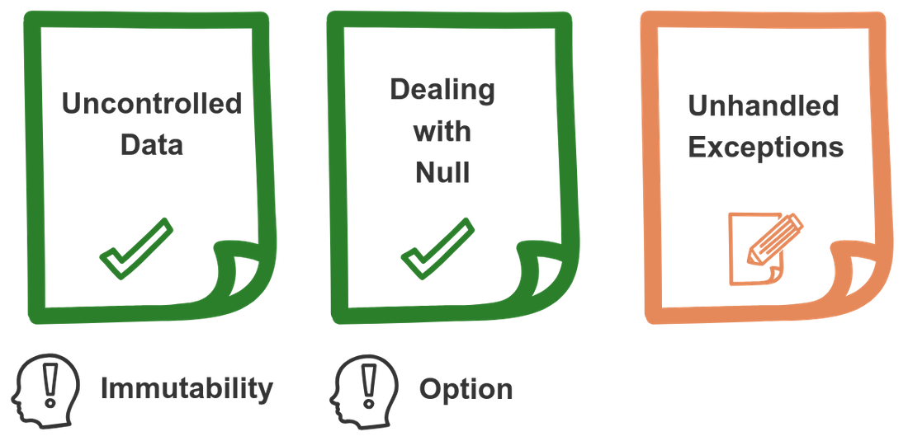
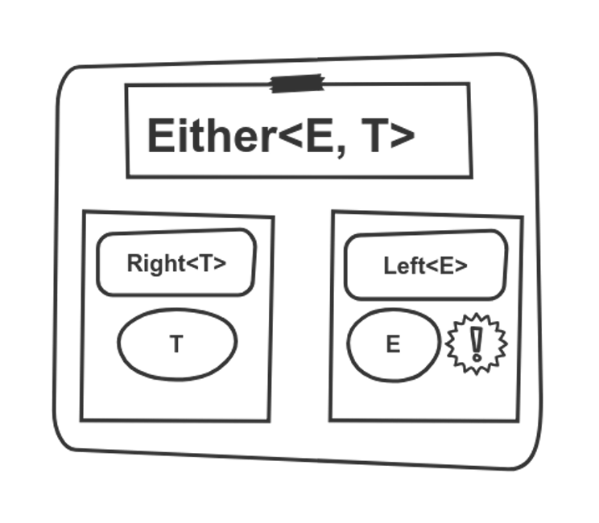
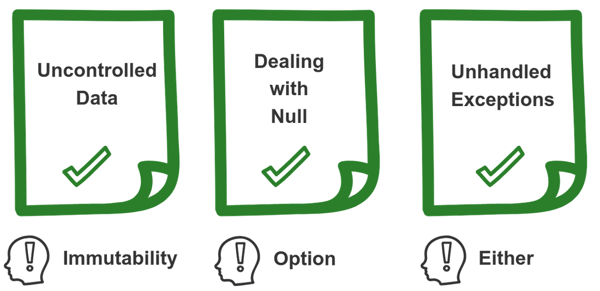

title: Lean backends using functional Kotlin
class: animation-fade
layout: true


<!-- This slide will serve as the base layout for all your slides -->

---

class: impact full-width
background-image: url(images/background1.jpg)

.impact-wrapper[
# {{title}}
]

???

Elevator pitch

- backend services
- using kotlin
- applying functional concepts to make code that is testable, maintainable and easy to understand

---

class: center middle

## What to expect from this talk

???

Content

- code examples that run in production
- introducing some concepts of FP
- not a FP tutorial, not a Kotlin tutorial

---

class: transition

## Mario Fernandez
## Andrei Bechet
 
 **Thought**Works
 
---

class: center middle

## Let's start with some context

---

class: center middle big-image



---

class: center middle big-image



---

class: center middle big-image


???

- it could be a DB as well

---

class: center middle

## Technologies that we will be mentioning

---

class: center middle

.image-grid[
.img[]
.img[]
.img[]
.img[]
]

---

class: transition
    
# Our pain points

---

class: middle

### I don't know the state of my data

--

### Half of my time I'm just dealing with *null* values

--

### The other half I'm debugging the **500s** thrown by our application

???

- TODO: think about how to present this
 
---

class: center middle



---

class: center middle


---

class: center middle

## Immutability

???

- What is immutability

---

class: center middle

```kotlin
data class TokenAuthentication(
        val id: Id,
        val firstName: FirstName,
        val lastName: LastName,
        val scopes: List<Scope>,
        val expiresAt: LocalDateTime
)
```

???

- Explain we use tokens as the example throughout

---

class: center middle


```kotlin
val scopes: List<Scope> = buildScopes(token) 

// List is immutable, it won't compile
scopes.removeAt(1) ❌

// Creates a new list
scopes.filter { it.isAdmin } ✅
```

---

class: center middle

## JSON

---

class: center middle

```kotlin
@JsonIgnoreProperties(ignoreUnknown = true)
data class TokenAuthentication(
        val id: Id,
        @JsonAlias("name_first")
        val firstName: FirstName,
        @JsonAlias("name_last")
        val lastName: LastName,
        @JsonDeserialize(converter = ListSanitizer::class)
        val scopes: List<Scope>,
        val expiresAt: LocalDateTime
)
```

---

class: center middle

## Dealing with change

---

class: center middle

```kotlin
// Will create a new object
fun TokenAuthentication.clearScopes() = copy(scopes = emptyList())
```

---

class: center middle

```kotlin
expectThat(token) {
    get { name }.isEqualTo("google-oauth2|3234123")
    get { authorities.map { it.authority } }.contains("create:recipes")
}
```

```console
org.opentest4j.AssertionFailedError: 
▼ Expect that Some(TokenAuthentication@52789c41):
  ▼ TokenAuthentication@52789c41: 
    Authenticated: true; 
    Authorities: profile, create:recipes:
    ▼ name:
      ✗ is equal to "google-oauth2|3234123" : found "google-oauth2|dude"
```

---

class: center middle

# Why Immutability?

## Easier to reason
## Always in a valid state
## Can be shared freely

???

- TODO: effective java picture
- TODO: better layout

---

class: center middle


---

class: center middle

```java
public static boolean isAdmin(List<Scope> scopes) {
    if(scopes == null) {
      return false;
    }

    Scope adminScope = findAdminScope(scopes);

    if(adminScope == null) {
      return false;
    }

    return adminScope.isValid();
  }
```

---

class: middle

## The billion dollar mistake

> I call it my billion-dollar mistake. It was the invention of the null reference in 1965. At that time, I was designing the first comprehensive type system for references in an object oriented language (ALGOL W). My goal was to ensure that all use of references should be absolutely safe, with checking performed automatically by the compiler. But I couldn't resist the temptation to put in a null reference, simply because it was so easy to implement. This has led to innumerable errors, vulnerabilities, and system crashes, which have probably caused a billion dollars of pain and damage in the last forty years.

---

class: center middle

## Nullable types

???

- This is what Kotlin offers us out of the box
- TODO: small kotlin logo

---

class: center middle

 ```
Authorization: Bearer bGciOi...JIUzI1NiIs
```

--

```kotlin
fun String.extractToken(): String? = if (startsWith("Bearer"))
    split(" ").last()
else
    null
```

--

```kotlin
header.extractToken()
  ?.let { token -> doStuff(token) }
```

---

class: center middle

## It can get messy

---

class: center middle



---

class: center middle

```kotlin
request.getHeader(Headers.AUTHORIZATION)
  ?.let { header ->
    header.extractToken()
      ?.let { jwt ->
        verifier.verify(jwt)
          ?.let { token ->
            SecurityContextHolder.getContext().authentication = token
          }
      }
  }
```

???

- TODO: colors

---
class: center middle



---

class: center middle
## Option Datatype

???

- TODO: small arrow logo

- as this is the first datatype that we present, this might be the moment to introduce what a datatype is. we can mention that `map` and `flatMap` are the standard functions

---

class: center middle

# Datatype? 🤔


.bottom-right[
An FP digression
]

--

class: center middle

## A datatype is an abstraction that encapsulates one reusable coding pattern.

---

class: center middle

```kotlin
interface Operations {
    fun <A, B> Option<A>.map(f: (A) -> B): Option<B>
    fun <A, B> Option<A>.flatMap(f: (A) -> Option<B>): Option<B>
}
```

.bottom-right[
An FP digression
]

???

- it is actually a typeclass

---

class: center middle

### hackernoon.com/kotlin-functors-applicatives-and-monads-in-pictures-part-1-3-c47a1b1ce251

.bottom-right[
An FP digression
]

---

class: center middle



???

- It is implemented with sealed classes

---

class: center middle

```kotlin
fun String.extractToken(): String? = if (startsWith("Bearer"))
    split(" ").last()
else
    null
```

```kotlin
fun String.extractToken(): Option<String> = startsWith("Bearer ")
        .maybe { split(" ").last() }
```

---

class: center middle

## Let's try our previous example with *Option*

---

class: center middle

```kotlin
request.getHeader(Headers.AUTHORIZATION)
  .toOption()
  .flatMap { header ->
    header.extractToken()
      .flatMap { jwt ->
        verifier.verify(jwt)
          .map { token ->
            SecurityContextHolder.getContext().authentication = token
        }
      }
  }
```

???

TODO: proper colors

---

class: center middle

## Not much of an improvement 😔

---

class: center middle

## Non-nested syntax thanks to arrow

???

- Similar to await/async in JS

---

class: center middle

```kotlin
Option.fx {
    val (header) = request.getHeader(Headers.AUTHORIZATION).toOption()
    val (jwt) = header.extractToken()
    val (token) = verifier.verify(jwt)
    SecurityContextHolder.getContext().authentication = token
}
```

???

TODO: align the code with the previous example

---

class: center middle

```kotlin
@Test
fun `verify does not work with a invalid jwt token`() {
    expectThat(
      RemoteVerifier(keySet).verify(jwt)
*   ).isEmpty()
}
```

---

class: center middle

# Why Option?
## Explicit about what can be null
## Avoid if-null litter
## Compile time checks
## Save a billion dollars 🤓

???

- TODO: are we missing benefits here

---

class: center middle



---

class: center middle

```console
com.auth0.jwt.exceptions.JWTDecodeException: 
  The string '{"typ":"JWT","alg":"RS256"}' is not a valid token.
      at com.auth0.jwt.impl.JWTParser.convertFromJSON(JWTParser.java:52)
      at com.auth0.jwt.impl.JWTParser.parseHeader(JWTParser.java:33)
      at com.auth0.jwt.JWTDecoder.<init>(JWTDecoder.java:37)
      at com.auth0.jwt.JWT.decode(JWT.java:21)
      at com.auth0.jwt.JWTVerifier.verify(JWTVerifier.java:352)
```

---

class: center middle

## Verifying our token

---

class: center middle


---

class: center middle

```kotlin
interface Verifier {
    fun verify(token: String): TokenAuthentication
}
```

---

class: center middle

## That signature is not quite telling the truth

---

class: center middle

```java
/**
 * Perform the verification against the given Token
 *
 * @param token to verify.
 * @return a verified and decoded JWT.
 * @throws AlgorithmMismatchException     
 * @throws SignatureVerificationException 
 * @throws TokenExpiredException          
 * @throws InvalidClaimException          
 */
public DecodedJWT verifyByCallingExternalApi(String token);
```

---

class: center middle


???

- verify will throw an exception whenever it is not succesful
- TODO: to which diagram should this refer to?

---

class: center middle

## Exceptions make the flow implicit

???

- the error case will ignore the path we defined before

---

class: center middle

## Exceptions force you to be aware of the internal implementation

.bottom-right[
kotlinlang.org/docs/reference/exceptions.html
]

???

- you cannot know that unless you inspect the implementation

---

class: center middle

```kotlin
@ExceptionHandler(JWTVerificationException::class)
fun handleException(exception: JWTVerificationException):
  ResponseEntity<ErrorMessage> {
    return ResponseEntity
      .status(HttpStatus.BAD_GATEWAY)
      .body(ErrorMessage.fromException(exception))
}
```

---

class: center middle

## Either DataType

---

class: center middle

## Option and Either are quite similar

.bottom-right[
An FP digression
]

???

- TODO: mention that Option and Either are similar? `Kind` perhaps?

---

class: center middle

```kotlin
interface Operations {
    fun <T, A, B> Either<T, A>.map(f: (A) -> B): Either<T, B>
    fun <T, A, B> Either<T, A>.flatMap(f: (A) -> Either<T, B>):
      Either<T, B>
}
```

.bottom-right[
An FP digression
]

---

class: center middle



???

- Either is a disjoint union. It means the result can be either one or the other, but not both

---

class: center middle

```kotlin
interface Verifier {
    fun verify(token: String): 
      Either<JWTVerificationException, TokenAuthentication>
}
```

---

class: center middle

## Isolating the problematic code

---

class: center middle

```kotlin
private fun JWTVerifier.unsafeVerify(token: String) = try {
    verify(token).right()
} catch (e: JWTVerificationException) {
    e.left()
}
```

???

- This is technically a side effect, which we will get back to later

---

class: center middle

## Operating with Either

---

class: center middle

```kotlin
override fun verify(token: String)
       : Either<JWTVerificationException, TokenAuthentication> {
    val key = key(keySet)
    val algorithm = algorithm(key)
    val verifier = verifier(algorithm, leeway)
    return verifier
*           .unsafeVerify(token)
*           .map { it.asToken() }
}
```

---

class: center middle

```kotlin
Either.fx<DownstreamException, List<Product>> {
    // Either<Throwable, ResponseEntity<UnprocessedResponse>> 
    val response = unsafeRequest() 
    val (body) = response
*          .mapLeft { DownstreamException("Unable to fetch products") }
    body.map()
}
```

???

- TODO: either rework to use tokens or delete

---

class: center middle

```kotlin
@GetMapping("{id}")
fun recipe(@PathVariable id: Int): ResponseEntity<RecipeDetails> {
    return when (val result = repository.find(id)) {
        is Either.Left -> ResponseEntity.status(result.a).build()
        is Either.Right -> ResponseEntity.ok(result.b)
    }
}
```

---

class: center middle

## Result
### kotlin-stdlib

---

class: center middle


```kotlin
fun unsafeOp() =
        runCatching { 
            doStuff()
        }.getOrElse { exception -> handle(exception) }
```

???

TODO: maybe start with this before the going into Either

---

class: center middle

```kotlin
@Test
fun `verify works if the expiration is not taken into account`() {
    val hundredYears = 3600L * 24 * 365 * 100
    val verifier = RemoteVerifier(keySet, hundredYears)

    expectThat(verifier.verify(jwt)).isRight().and {
        get { name }
          .isEqualTo("google-oauth2|111460419457288935787")
        get { authorities.map { it.authority } }
          .contains("create:recipes")
    }
}
```

---

class: center middle

# Why Either?
## Makes flow explicit
## Interface tells the whole truth
## Compile time checks

---

class: center middle



---

class: transition

# Bonus

---

class: center middle

## Purely functional code

---

diagram of edge of the world

---

class: center middle

## IO

???

Next steps slide (maybe) ? 

---

class: center middle

`IO<Either<JWTVerificationException, TokenAuthentication>>`

---

class: center middle

## We are hitting the limit of what's convenient to do with Kotlin and Arrow here

---

class: transition

# Wrap Up

---

???

TODO: journey metaphor (treasure map?)

---

???

- TODO: logo of kotlin inside a server, logo of FP (lambda)

---

class: center middle

# At your own pace!

???

- No blueprint for everybody
- Every team has different needs

---

class: impact full-width
background-image: url(images/background5.jpg)

.impact-wrapper[
## JOIN OUR COMMUNITY

<br />

### *26 years* experience
### *42 offices* in 13 countries
### *Thought leader* in agile software development and continuous delivery
### *6000+* thoughtworkers worldwide
### *300+* thoughtworkers in Germany

<br />

#### de-recruiting@thoughtworks.com
]

---


